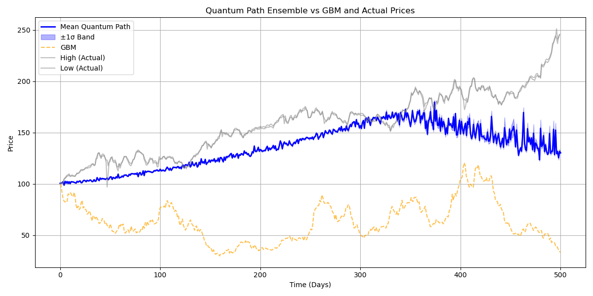

# 📈 Quantum Finance: Schrödinger Equation for Stock Price Modeling

[](https://www.python.org/)
[](https://opensource.org/licenses/MIT)

This project explores an unconventional use of the **time-dependent Schrödinger Equation (TDSE)** to simulate stock price behavior — comparing it against the widely-used **Geometric Brownian Motion (GBM)** model.

> ✨ *Can quantum physics capture market behavior better than stochastic finance?*

---

## 🔍 Overview

We model price evolution using:
- ⚙️ **Geometric Brownian Motion (GBM)** — the standard model for asset prices.
- 🧠 **Quantum Wavefunctions** — probability fields evolving under a dynamic market potential.

These are tested against historical stock data from **Apple Inc. (AAPL)**.

---

<pre> 📁 Project Structure ├── Datasets/ ├── TDSE_Solver.py # Schrödinger equation (TDSE) simulation engine ├── quantum_walk.py # Quantum simulation with adaptive market potential ├── random_walk_price.py # Benchmark: AR(1) vs GBM simulation ├── preview_chart.png # Visualization output └── README.md # Project overview (this file) </pre>

---

## 📈 Modeling Approaches

<details>
<summary><strong>1. Benchmark Model (random_walk_price.py)</strong></summary>

- Loads real historical data and normalizes prices
- Simulates stock price evolution using:
  - 🔁 **AR(1)** process (autocorrelated returns)
  - 📉 **GBM** using inferred μ and σ
- Overlays simulated paths with actual price highs and lows
</details>

<details>
<summary><strong>2. Quantum Price Model (quantum_walk.py + TDSE_Solver.py)</strong></summary>

- Initializes wavefunction with:
  - `x₀` = starting price  
  - `p₀` = trend estimate from linear regression  
  - `σ` = rolling volatility → quantum uncertainty

- Evolves using **Split-Operator Fourier Method**
- Market potential adapts to:
  - Recent price momentum
  - Mean-reversion behavior
  - Volatility-driven exploratory pushes
- Samples probabilistic paths from evolving wavefunction
- Applies **Kalman filter** for optional smoothing
</details>

---

## 📊 Sample Output

<p align="center">
  
</p>

- 🔵 **Mean Quantum Path**
- 🔷 **±σ Confidence Band**
- ⚪️ **Actual High/Low Prices**

---

## ⚙️ Setup

Install dependencies with:

```bash
pip install numpy pandas matplotlib scipy yfinance filterpy
```

## ▶️ How to Run
### 🧪 Classical Simulation
```bash
python random_walk_price.py
```
### 🧠 Quantum TDSE Simulation
```bash
python quantum_walk.py
```
## 🧰 Custom Market Potential
```bash
def V_market_adaptive(x, t, center, x_expect, p_expect, sigma, volatility):
    revert_strength = 0.001
    trend_strength = 0.07
    push = ...
    return V
```
Captures:
- 📉 Mean reversion to a moving center

- ➕ Momentum direction based on price drift

- 🌪 Volatility-sensitive “push” dynamics

